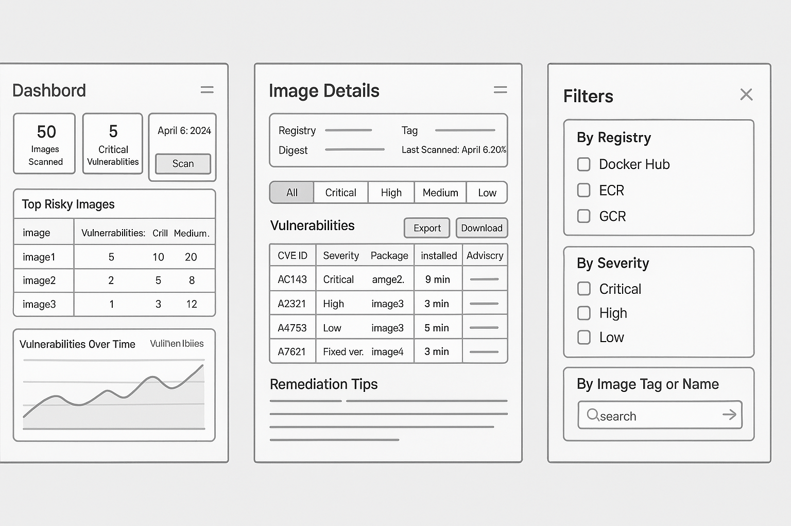

# Wireframe – Dashboard

## Objective
Provide a high-level summary of the security posture across container images.

## Visual Reference

Below is a grayscale wireframe that outlines the layout of the Dashboard, Image Details, and Filter views.

## Layout Components
- **Header:**
  - App logo, Navigation tabs (Dashboard, Images, Reports)

- **Summary Cards (Top Row):**
  - Total Images Scanned
  - Critical Vulnerabilities
  - High Vulnerabilities
  - Last Scan Timestamp

- **Top Risky Images Table:**
  | Image Name | Registry | CVE Count | Critical | High | Medium | Last Scanned |
  |------------|----------|-----------|----------|------|--------|--------------|

- **Vulnerability Trends Graph:**
  - Line or bar chart showing change in CVEs over time

- **Recent Activity Panel:**
  - List of recent image scans with status (Success, Failed)

## User Actions
- Filter by registry or severity
- Navigate to image details
- Initiate a new image scan

